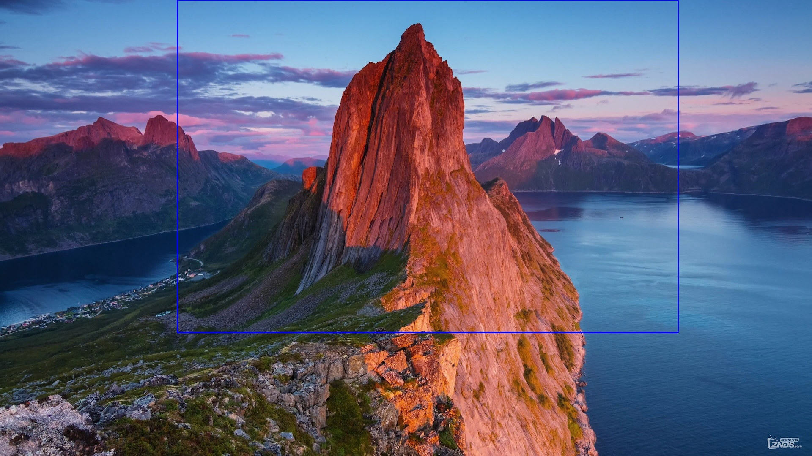

## 2023.01.09

编写了python文件 `testOpenCV.py`，实现大图中找小图的操作。

`testOpenCV.py`代码如下：

```python
import cv2
import numpy as np
import sys
import os

# 大图小图所在位置
big_image_address = 'samples/big_image'
small_image_address = 'samples/small_image'

# 加载大图和小图
img = cv2.imread(os.path.join(big_image_address, 'big_image.jpg'), 0)
template = cv2.imread(os.path.join(small_image_address, 'small_image.jpg'), 0)

# 获取小图的宽度和高度
w, h = template.shape[::-1]

# 使用matchTemplate函数来找到小图在大图中的位置
res = cv2.matchTemplate(img, template, cv2.TM_CCOEFF_NORMED)

# 使用minMaxLoc函数来获取匹配结果的最大和最小值，以及它们的位置
min_val, max_val, min_loc, max_loc = cv2.minMaxLoc(res)

# 使用矩形函数在大图上标记出小图的位置
top_left = max_loc
bottom_right = (top_left[0] + w, top_left[1] + h)
cv2.rectangle(img, 
              top_left, bottom_right, 255, 2)

# 显示结果
cv2.imshow('Detected', img)
cv2.waitKey(0)
cv2.destroyAllWindows()
```

#### TODO

* 每次改变样本，都需要重新修改代码。
* 得到的图片没有保存。
* 可以讲专门用途的代码重构为函数。

## 2023.01.10

### 15:10 优化`testOpenCV.py`文件

修改了`testOpenCV.py`文件，实现了如下功能：

1. 每次变更图片只需要修改三个参数（`image_type`, `sample_num`, `image_num`）
2. 引入`big_image_path_gen`, `small_image_path_gen`，可以更快的获取代码位置
3. 将识别算法封装在`match_template`函数中

优化了文件夹命名规范：

* samples
  * normal
    * big_image
    * small_image
    * noisy_image
  * stm
    * big_image
    * small_image
    * noisy_image

`normal`文件夹用于开发程序的识别能力，里面的图片是从网上下载得到。`stm`文件夹的图片是实际需要识别的图片，用于测试程序是否成功识别图片位置。

`testOpenCV.py`文件如下：

```python
import cv2
import numpy as np
import sys
import os

def match_template(big_image_path, small_image_path):
    # 加载大图和小图
    img = cv2.imread(big_image_path, 0)
    template = cv2.imread(small_image_path, 0)

    # 获取小图的宽度和高度
    w, h = template.shape[::-1]

    # 使用matchTemplate函数来找到小图在大图中的位置
    res = cv2.matchTemplate(img, template, cv2.TM_CCOEFF_NORMED)

    # 使用minMaxLoc函数来获取匹配结果的最大和最小值，以及它们的位置
    min_val, max_val, min_loc, max_loc = cv2.minMaxLoc(res)

    # 使用矩形函数在大图上标记出小图的位置
    top_left = max_loc
    bottom_right = (top_left[0] + w, top_left[1] + h)

    return top_left, bottom_right

def small_image_path_gen(image_type, sample_num, image_num):
    """
    生成小图像路径。

    参数：
    image_type (int) -- 图像类型，0表示正常图像，1表示STM图像
    sample_num (int) -- 样本编号
    image_num (int) -- 图像编号

    返回：
    small_image_path (str) -- 小图像路径
    """

    if image_type == 0:
        image_type_path = "normal"
    elif image_type == 1:
        image_type_path = "stm"
    else:
        print("image_type error!")
        sys.exit(1)

    small_image_path = os.path.join("samples", image_type_path,
                                     "sample" + str(sample_num).zfill(2), 
                                     "small_image", 
                                     "small_image_" + str(image_num).zfill(2) + 
                                     ".jpg")
    return small_image_path

def big_image_path_gen(image_type, sample_num):
    """
    生成大图像路径。

    参数：
    image_type (int) -- 图像类型，0表示正常图像，1表示STM图像。
    sample_num (int) -- 样本编号。

    返回：
    big_image_path (str) -- 大图像路径。
    """

    if image_type == 0:
        image_type_path = "normal"
    elif image_type == 1:
        image_type_path = "stm"
    else:
        print("image_type error!")
        sys.exit(1)

    big_image_path = os.path.join("samples", image_type_path,
                                     "sample" + str(sample_num).zfill(2), 
                                     "big_image", 
                                     "big_image" + 
                                     ".jpg")
    return big_image_path


# 用于测试的主函数
if __name__ == '__main__':
    # if len(sys.argv) != 3:
    #     print('Usage: python match_template.py big_image_path small_image_path')
    #     sys.exit(1)

    # 使用命令行时用argv[]来获取参数
    # big_image_path = sys.argv[1]
    # small_image_path = sys.argv[2]
        
    # 使用IDE时用下面的参数
    #----------------------------------------------------
    # 图片类型：0-普通，1-stm
    image_type = 0
    # 样本编号
    sample_num = 1
    # 图片编号
    image_num = 1
    #----------------------------------------------------

    # 生成小图路径
    small_image_path = small_image_path_gen(image_type, sample_num, image_num)
    # 生成大图路径
    big_image_path = big_image_path_gen(image_type, sample_num)
    # 获取小图在大图中的位置
    top_left, bottom_right = match_template(big_image_path, small_image_path)

    # 加载大图
    img = cv2.imread(big_image_path)

    # 标记小图在大图中的位置
    cv2.rectangle(img, top_left, bottom_right, 255, 2)

    # 显示结果
    cv2.imshow('Detected', img)
    cv2.waitKey(0)
    cv2.destroyAllWindows()
```

#### 成果展示

大图：


小图：


结果：


#### 增加噪声

对每一个像素增加一个分布为$N\sim(0,1)$再乘50的噪声：

```python
noise = np.round(np.random.normal(0, 1, image.shape) * 50)
```

得到如下图的增加噪声的图像：


此图像依然可以识别得到，具体的结果不再展示。

#### 需要解决的问题

如果需要识别的小图的分辨率与实际大图中的小图不符时，会出现结果的大图中，框选的大小长宽与需要识别的小图大小一致，具体可见下图：



